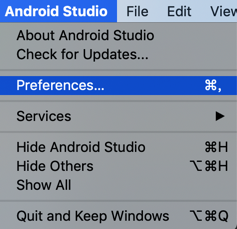
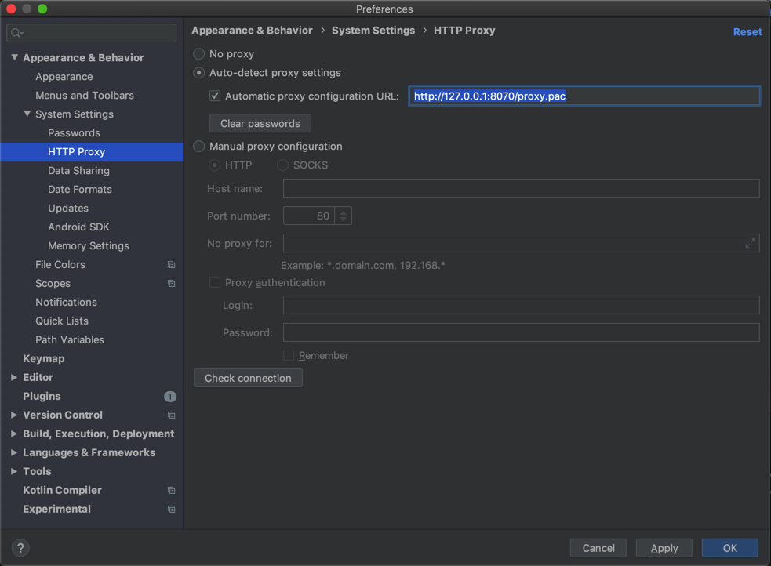

# Android Studio

给android studio加代理

设置为 **PAC自动代理**：

* `Appearance & Behavior`->`System Settings`->`HTTP Proxy`->`Auto-detect proxy settings`:
  * 勾选☑️：`Automatic proxy configuration URL`
    * 值为：`http://127.0.0.1:8070/proxy.pac`

