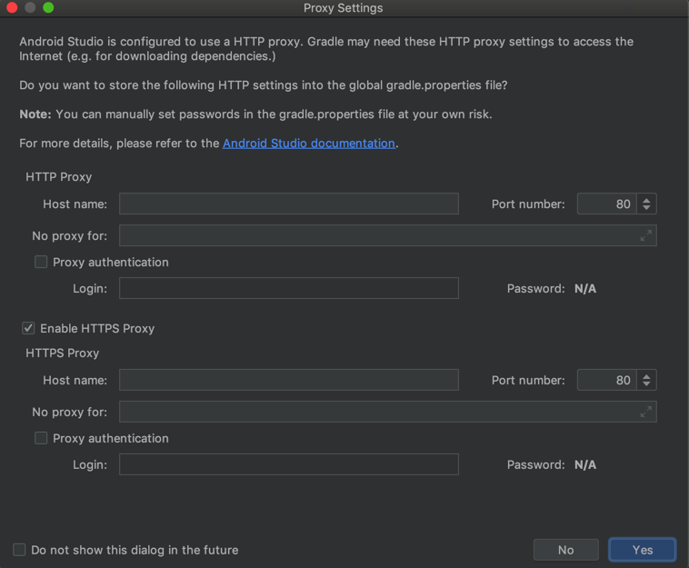

# gradle

android studio中给gradle加代理

升级了Android Studio，弹框问是否要设置Gradle的代理：



其中的：
* HTTP
  * host
  * No proxy for
  * Proxy authentication
    * Login
    * Password
* HTTPS
  * host
  * No proxy for
  * Proxy authentication
    * Login
    * Password

等内容，其实就是对应着：

* gradle官网
  * [Accessing the web through a HTTP proxy](https://docs.gradle.org/current/userguide/build_environment.html#sec:accessing_the_web_via_a_proxy)

中提到的：

* Configuring an HTTP proxy using gradle.properties
    ```bash
    systemProp.http.proxyHost=www.somehost.org
    systemProp.http.proxyPort=8080
    systemProp.http.proxyUser=userid
    systemProp.http.proxyPassword=password
    systemProp.http.nonProxyHosts=*.nonproxyrepos.com|localhost
    ```

和：

* Configuring an HTTPS proxy using gradle.properties
    ```bash
    systemProp.https.proxyHost=www.somehost.org
    systemProp.https.proxyPort=8080
    systemProp.https.proxyUser=userid
    systemProp.https.proxyPassword=password
    systemProp.https.nonProxyHosts=*.nonproxyrepos.com|localhost
    ```

的
系统属性`systemProp`中的`http`和`https`的

* proxyHost
* proxyPort

如果要登录认证，再需要：

* proxyUser
* proxyPassword

以及有哪些特殊的url需要被排除掉，可以加到：

* nonProxyHosts

而此处，想要全局的gradle都用上代理，可以去把这部分代理配置，加到：

* gradle的全局配置文件
  * 当前用户下面的`gradle.properties`中
    * Linux系（Linux/Mac等）
      * `$HOME/.gradle/gradle.properties`
    * Win系
      * `%userprofile%\.gradle\gradle.properties`

在其中加上对应配置，比如：

```bash
systemProp.http.proxyHost=127.0.0.1
systemProp.http.proxyPort=58591
systemProp.https.proxyHost=127.0.0.1
systemProp.https.proxyPort=58591
```

> 注：
> 
> 其中此处的proxyHost和proxyPort，是我此处`Trojan`的代理配置。
> 
> （可以在`Trojan-QT5`的界面中看到，或从菜单`复制终端代理命令`中拷贝出来）
