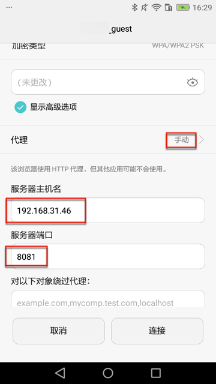
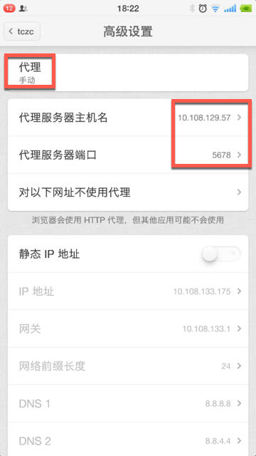

# Android

此处介绍如何给Android手机中的WiFi去设置代理。

核心逻辑是：进入WiFi详情页，开启代理，输入代理配置信息，即可。

比如：

* 华为畅享6S
  * 
* 锤子M1L
  * 步骤：设置->无线网络->点击你要设置代理的Wifi->高级设置
  * WiFi代理配置信息
    * 代理：`手动`
    * 设置Charles中的代理配置：
      * 代理服务器主机名：`10.108.129.57`
      * 代理服务器端口：`5678`
  * 图
    * 
