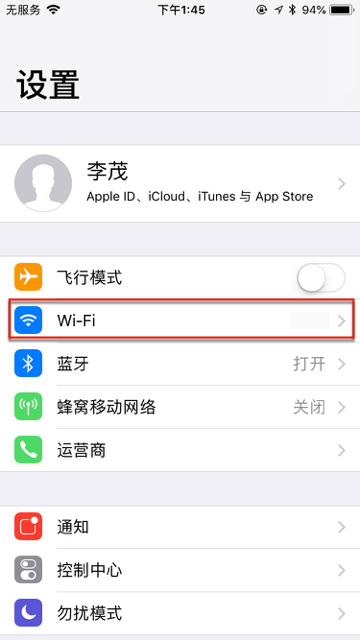
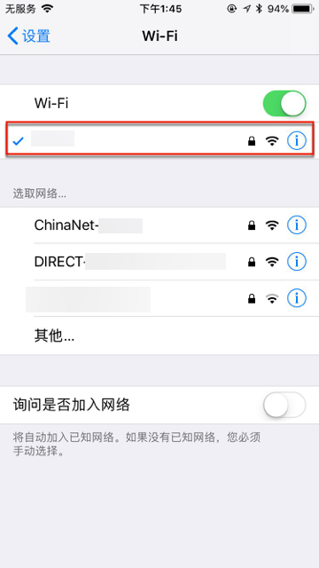
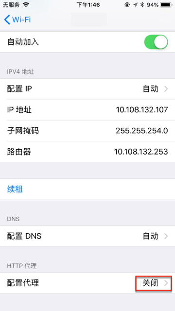
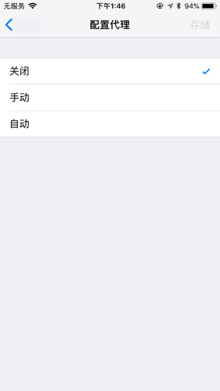
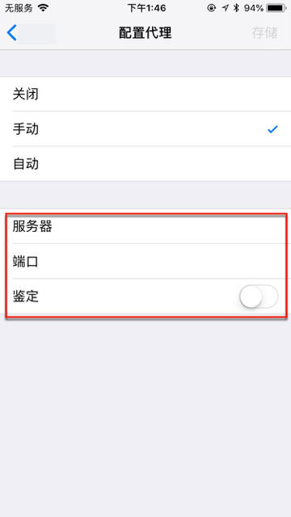
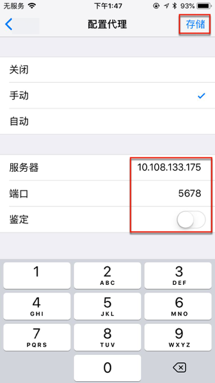
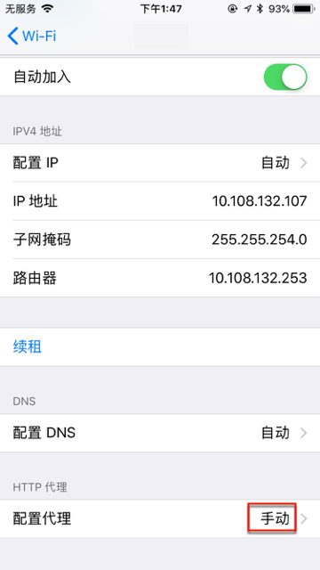

# iOS

下面介绍，如何在iOS的iPhone中，设置代理。

## iPhone中给WiFi设置添加代理

从设置中：

点击对应的WiFi，进入无线局域网：

点击当前的WiFi，进入Wifi详情页。

默认是`HTTP代理->配置代理：关闭`

点击配置代理，进入设置页：

点击`手动`，出现`服务器`、`端口`、`鉴定`等选项：

然后输入对应的代理配置信息：

再点击右上角的`存储`，即可保存并返回上一页，看到`配置代理`已变成`手动`：

即表示已手动设置好代理了。
