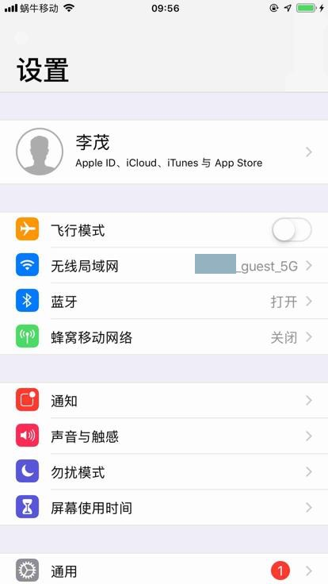
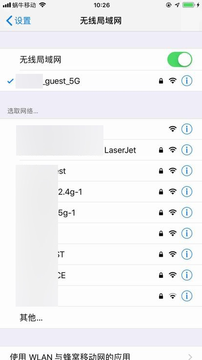
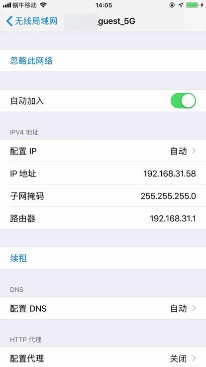
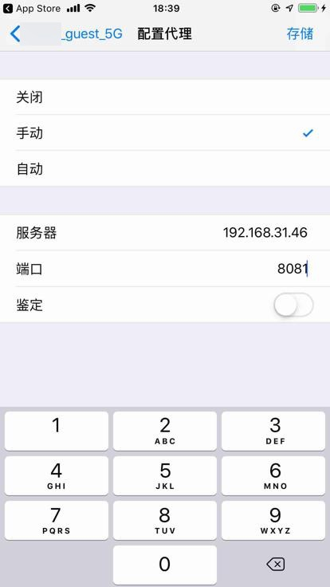
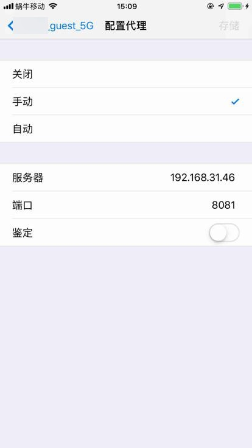
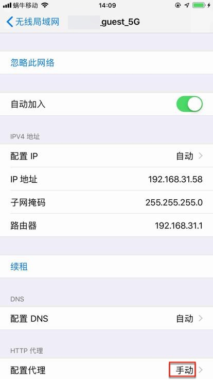

# iOS

下面介绍，如何在iOS的iPhone中，设置代理。

## iPhone中给WiFi设置添加代理

从设置中：

点击对应的WiFi，进入无线局域网：

点击当前的WiFi，进入Wifi详情页。

默认是 HTTP代理->配置代理：关闭

点击配置代理，进入设置页：

点击 自动，并且输入对应的 服务器 和 端口：

再点击右上角的 存储，即可保存：

然后即可返回上一页，看到 配置代理 变成 手动：

即表示已手动设置好代理了。
