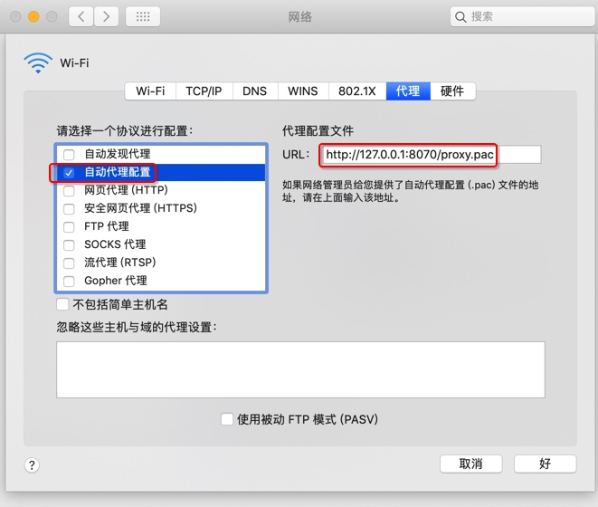

# Mac

## Mac中的WiFi网络和浏览器自动代理

在用Trojan等客户端，实现科学上网后

* Mac中的WiFi网络，自动加上了代理配置：
  * 自动PAC代理
    * 
      * 自动代理配置
        * http://127.0.0.1:8070/proxy.pac

然后Mac中，后续用Safari/Chrome浏览器上网，即可自动用上代理，实现科学上网了。
