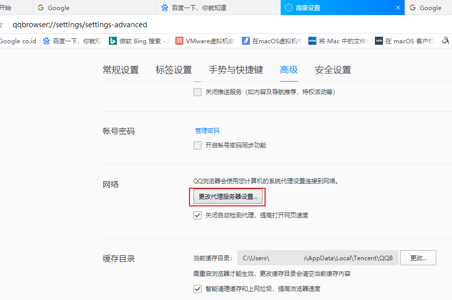
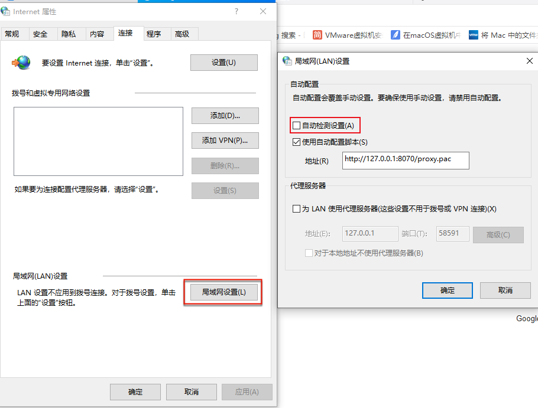

# 浏览器

## QQ浏览器

win10中给QQ浏览器加上自动代理

代理设置

qqbrowser://settings/settings-advanced

-》网络 更改代理服务器配置

### 相关内容：WiFi网络已连接，但是QQ浏览器无法上网

* **原因**：代理配置的问题
* **解决办法**：去掉代理，即可上网
  * 具体步骤：QQ浏览器-》设置-》高级-》网络-》更改代理服务器设置-》（系统的）Internet属性-》连接-》局域网LAN设置-》局域网设置-》代理服务器-》取消勾选：为LAN使用代理服务器-》确定
  * 注：
    * 之前自己的本地代理的软件[Trojan](https://book.crifan.com/books/scientific_network_summary/website/trojan/)，不论是否启动，是否开启或关闭，都不会影响QQ浏览器上网的。
    * 此处不知道，是什么程序，软件，何时何地，去改了此处的系统的代理，导致无法上网
    * 所以根本原因：未知
