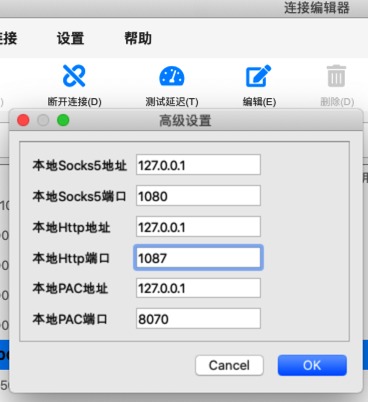

# requests

## python的网络库requests中加proxy代理

前提：确保自己的代理正常。比如此处的`V2RayU`中的代理：



代码：

此处给（调用WordPress的REST的api时的）网络请求加上代理：

```python
cfgProxies = {
    "http"  : "http://127.0.0.1:1087",
    "https" : "http://127.0.0.1:1087",
}

resp = requests.post(
    createPostUrl,
    proxies=cfgProxies,
    headers=curHeaders,
    json=postDict,
)
```

即可。
