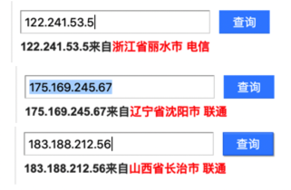

# 代理IP检测

另外，对于如何查看到自己当前的IP，可以用：

[dobelcloud/PythonRequestsDemo.py at master · dobelgit/dobelcloud](https://github.com/dobelgit/dobelcloud/blob/master/Python/PythonRequestsDemo.py)

提到的：

https://www.taobao.com/help/getip.php

得到：

```php
ipCallback({ip:"222.92.130.218"})
```

或：

[隧道代理接入文档 | 蜻蜓代理 - 企业级高质量代理ip平台](https://proxy.horocn.com/news/wQqd.html)

提到的：

https://proxy.horocn.com/api/ip

```bash
222.92.130.218
```

## 代码测试IP是否相同

在买了动态IP代理后，希望搞清楚是否生效，即每次获取的IP是否的确不同，可以自己写代码测试。

下面是我的测试代码，以阿布云的代理为例，供参考：

```python
# test proxy IP

import requests

#目标网址
targetUrl = "http://httpbin.org/get"
# targetUrl = "http://test.abuyun.com"
# targetUrl = "https://www.taobao.com/help/getip.php"
# targetUrl = "http://proxy.abuyun.com/switch-ip"
# targetUrl = "http://proxy.abuyun.com/current-ip"

#http代理接入服务器地址端口
proxyHost = "http-dyn.abuyun.com"
proxyPort = "9020"

#账号密码
proxyUser = "password1"
proxyPass = "password2"

proxyMeta = "http://%(user)s:%(pass)s@%(host)s:%(port)s" % {
  "host" : proxyHost,
  "port" : proxyPort,
  "user" : proxyUser,
  "pass" : proxyPass,
}

proxies = {
  "http"  : proxyMeta,
  "https" : proxyMeta,
}

result = requests.get(targetUrl, proxies=proxies)
# result = requests.get(targetUrl)

print("result=%s" % result)
print("result.status_code=%s" % result.status_code)
print("result.text=%s" % result.text)
```

效果是所希望的，正常的，每次IP都不同：

```bash
result=<Response [200]>
result.status_code=200
result.text={
  "args": {}, 
  "headers": {
    "Accept": "*/*", 
    "Accept-Encoding": "gzip", 
    "Host": "httpbin.org", 
    "User-Agent": "python-requests/2.19.1"
  }, 
  "origin": "122.241.53.5, 122.241.53.5", 
  "url": "https://httpbin.org/get"
}

result=<Response [200]>
result.status_code=200
result.text={
  "args": {}, 
  "headers": {
    "Accept": "*/*", 
    "Accept-Encoding": "gzip", 
    "Host": "httpbin.org", 
    "User-Agent": "python-requests/2.19.1"
  }, 
  "origin": "175.169.245.67, 175.169.245.67", 
  "url": "https://httpbin.org/get"
}

result=<Response [200]>
result.status_code=200
result.text={
  "args": {}, 
  "headers": {
    "Accept": "*/*", 
    "Accept-Encoding": "gzip", 
    "Host": "httpbin.org", 
    "User-Agent": "python-requests/2.19.1"
  }, 
  "origin": "183.188.212.56, 183.188.212.56", 
  "url": "https://httpbin.org/get"
}
```

查查这几个IP都是哪里的：



看起来效果不错。
