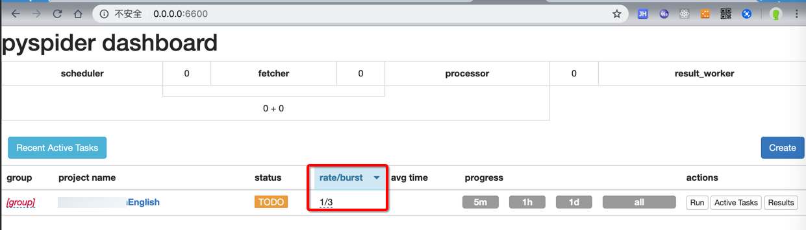

# 每秒请求次数

很多代理提供商（的不同套餐）都有提到：每秒请求次数
即：每秒的请求，不能超过几次

比如：

* [动态版HTTP隧道服务说明 | 阿布云 - 为大数据赋能](https://www.abuyun.com/http-proxy/dyn-intro.html)
  * 动态版 HTTP隧道 有并发请求限制，默认每秒只允许 5 个请求
    * 如果需要更多请求数，请额外购买
* [多贝云|动态IP代理拨号代理VPN代理动态HTTP代理](http://dobel.cn/act/https_package/index.html)
  * 单账号每秒请求数默认10个，可以升级到100个

意味着：

比如此处的PySpider中的`rate/burst`

中的表示每秒几个请求的rate，不能超过上面的限制

即：此处rate如果设置了超过买的套餐的次数限制，后续请求会报错 `429 Too many requests`

就像这里的解释：

* [多贝云|动态IP代理拨号代理VPN代理动态HTTP代理](http://dobel.cn/act/https_q_a/index.html)
  > 一秒内发起的所有请求数之和，如果超出套餐限制的值，那么多出的部分会被拒绝访问（提示`429 Too many requests!`），这时候需要购买更多的请求数以满足业务需求
