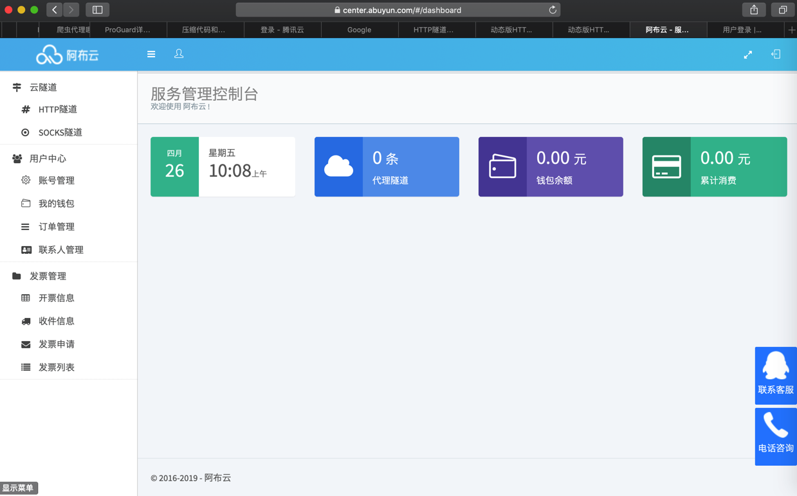
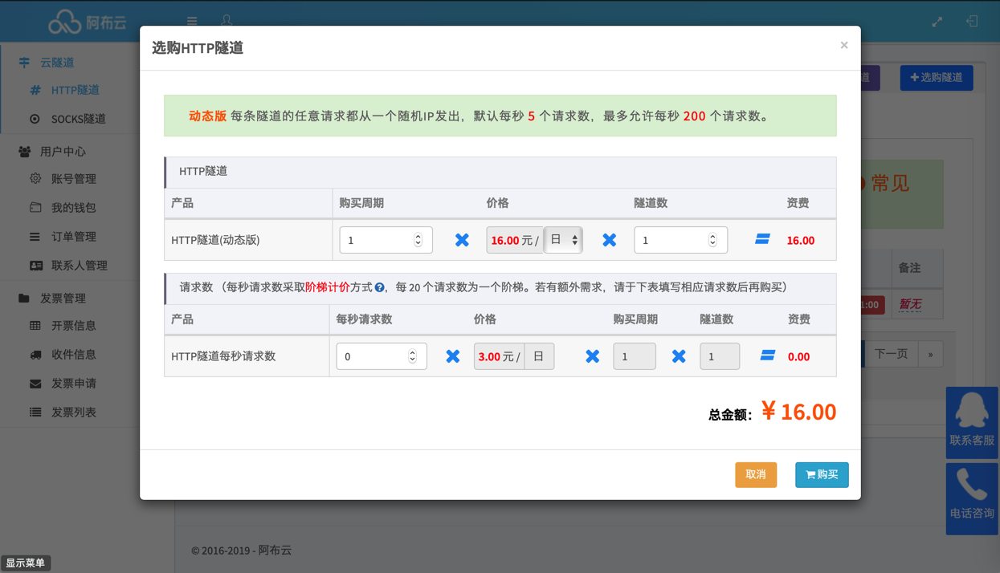

# 阿布云代理

之前自己为了反扒，去[买了阿布云的代理](https://www.crifan.com/purchase_a_dynamic_ip_proxy_with_different_ip_for_each_request_of_abu_cloud)，实现了每次请求IP都不同的动态IP的效果，效果还不错。

* 阿布云代理
  * 主页
    * HTTP隧道产品
      * https://www.abuyun.com/http-proxy/products.html

## 购买阿布云的HTTP隧道代理

[HTTP隧道产品 | 阿布云 - 为大数据赋能](https://www.abuyun.com/http-proxy/products.html)

购买 HTTP隧道 动态版


* 服务说明
  * [动态版HTTP隧道服务说明 | 阿布云 - 为大数据赋能](https://www.abuyun.com/http-proxy/dyn-intro.html)
* 接入指南
  * [动态版HTTP隧道接入指南 | 阿布云 - 为大数据赋能](https://www.abuyun.com/http-proxy/dyn-manual.html)
    * Python
      * [HTTP隧道（动态版）Python 接入指南| 阿布云 - 为大数据赋能](https://www.abuyun.com/http-proxy/dyn-manual-python.html)

先去[注册](https://center.abuyun.com/register#/)，进入[后台](https://center.abuyun.com/#/dashboard)：



点击了 申请免费测试隧道 后：


即可申请到 免费测试时间：4个小时 的动态IP。

经过测试无误后，即可后续继续购买。

比如 购买1天的：




跳转到支付宝付款，成功付款后返回订单列表：


进入[云隧道->HTTP代理](https://center.abuyun.com/#/cloud/http-proxy/tunnel/lists)，可看到已购产品列表：


得到了`通行证书`和`通行密钥`，就是**用户名**和**密码**，即可放在代码中使用。

## 账号过期

如果后续所购服务过期了仍继续调用接口，则会报错`HTTP 402: Payment Required`。

比如`PySpider`中的报错：

```bash
[W 190502 10:04:59 tornado_fetcher:423] [402] DianpingChildrenEnglish:03d7573282446a107bf426f38e30f406 http://www.dianping.com/shop/98532606#221048_745240 0.06s
[E 190502 10:04:59 processor:202] process DianpingChildrenEnglish:03d7573282446a107bf426f38e30f406 http://www.dianping.com/shop/98532606#221048_745240 -> [402] len:312 -> result:None fol:0 msg:0 err:HTTPError('HTTP 402: Payment Required',)
```

解决办法：重新续费，或者购买新服务，再去代码中换上新的`通行证书`和`通行密钥`，即可。
