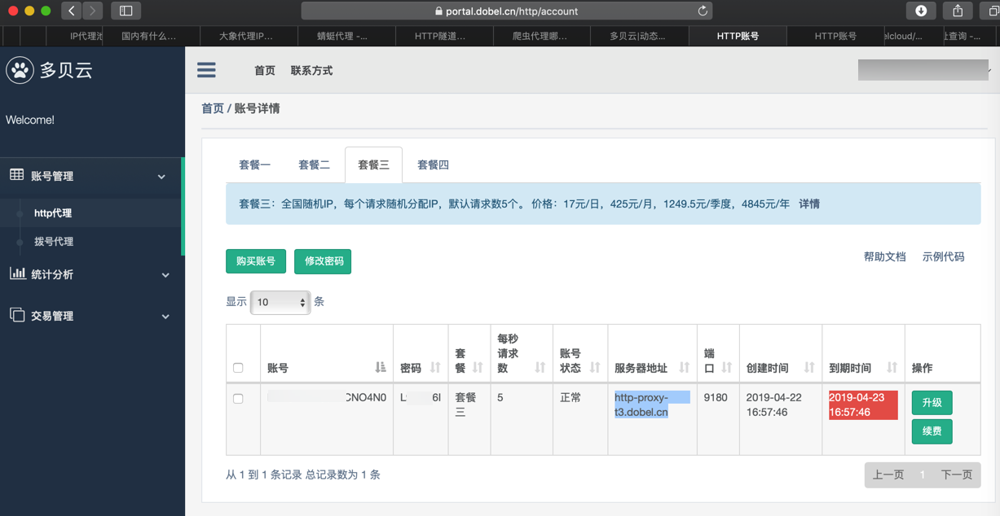
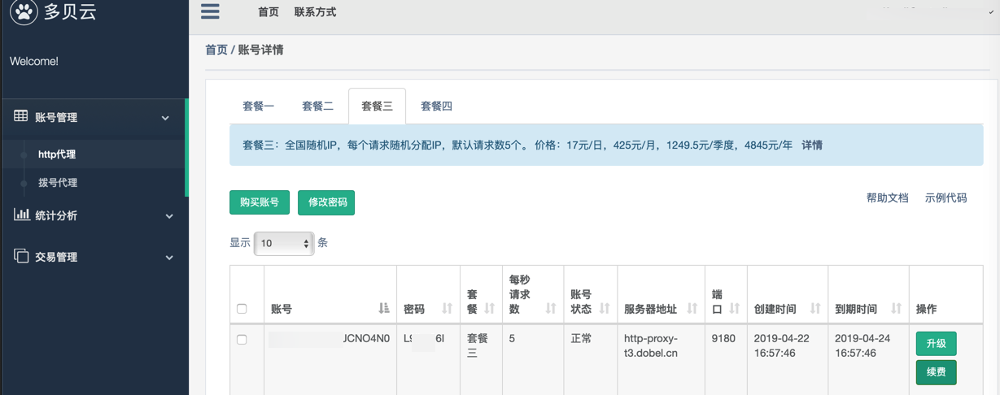
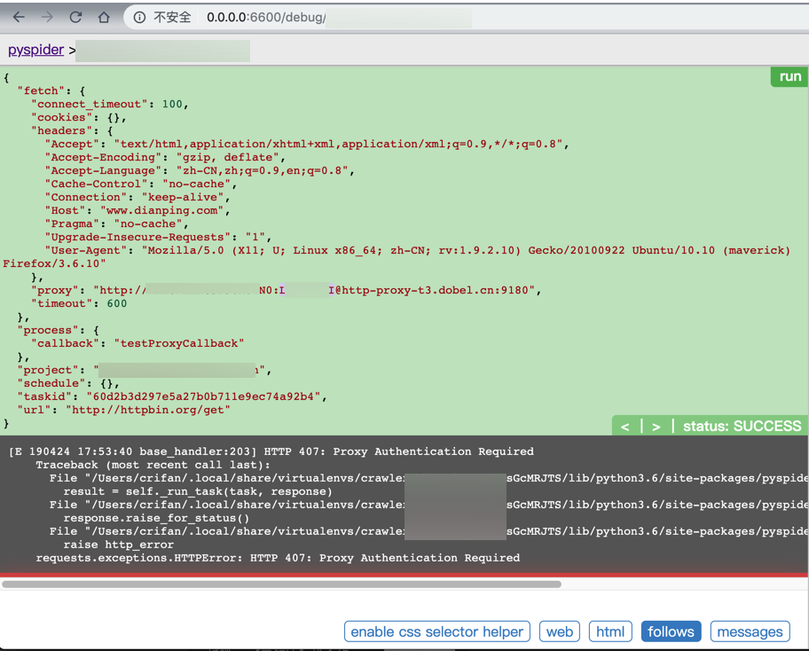

# 多贝云代理

之前也去用过

[多贝云的HTTP代理](https://dobel.cn/act/https_pro/index.html)

觉得也还可以。

下面记录购买和使用过程。

## 不同套餐对比

* 多贝云
  * 套餐2：每一段时间内的请求，IP都是固定不变的
    * 注：
      * 套餐2的时间是7~10分钟
      * 套餐1是1~2分钟
    * 有效期过了后，会自动更换新IP的
      * 无需手动更换
      * 当然如果想要手动，主动，更换IP，也是支持的
        * 详见：多贝云|动态IP代理拨号代理VPN代理动态HTTP代理
          * 主动切换IP：
            * 整个过程无需变更代理服务器和端口信息，而是通过调用API实现自动切换IP。应用程序通过HTTP隧道请求 http://ip.dobel.cn/switch-ip ，请求执行成功会返回一个新的IP地址及其剩余可用时长，后续的请求将都会通过新的出口IP地址进行转发
          * 查看当前IP
            * 请求 http://ip.dobel.cn/current-ip 能够获取到当前分配到出口IP以及剩余的可用时长信息。
            * 举例
              * `curl -x http-proxy-t2.dobel.cn:9180 -U ProxyUsername:ProxyPassword http://ip.dobel.cn/current-ip`
              * 返回：
              * `{"wanip":"117.69.50.223","resttime":-215}%`
  * 套餐3：每次请求，IP都不同
    * 才是我们希望的，动态IP

## 购买多贝云的HTTP代理

从

[多贝云|动态IP代理拨号代理VPN代理动态HTTP代理](http://dobel.cn/act/https_package/index.html)

点击 套餐3


再去选择具体配置：


用支付宝支付后，返回订单：


返回 账号管理->http代理，即可看到已购产品：



把其中的**账号**和**密码**放在代码中，即可使用。

## 使用多贝云

关于如何在代码中使用多贝云代理，可以参考后续章节：[PySpider中使用代理](http://book.crifan.com/books/web_transfer_proxy_tech/website/add_proxy/program_language/python/requests.html)

用了一段时间后，还可以去看统计信息：


## 账号过期

如果账号过期了：



则（PySpider中）会出现：

`requests.exceptions.HTTPError: HTTP 407: Proxy Authentication Required`

的错误：

```bash
[E 190424 17:53:40 base_handler:203] HTTP 407: Proxy Authentication Required
    Traceback (most recent call last):
      File "/Users/crifan/.local/share/virtualenvs/ crawler_xxx-sGcMRJTS/lib/python3.6/site-packages/pyspider/libs/base_handler.py", line 196, in run_task
        result = self._run_task(task, response)
      File "/Users/crifan/.local/share/virtualenvs/ crawler_xxx-sGcMRJTS/lib/python3.6/site-packages/pyspider/libs/base_handler.py", line 175, in _run_task
        response.raise_for_status()
      File "/Users/crifan/.local/share/virtualenvs/ crawler_xxx-sGcMRJTS/lib/python3.6/site-packages/pyspider/libs/response.py", line 184, in raise_for_status
        raise http_error
    requests.exceptions.HTTPError: HTTP 407: Proxy Authentication Required
```


