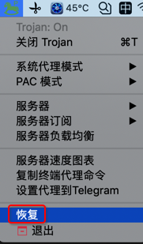
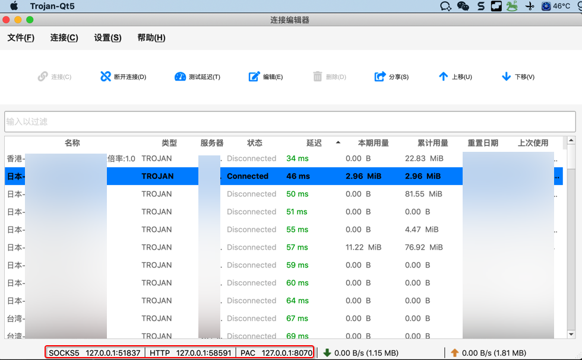
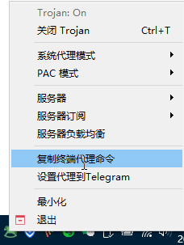
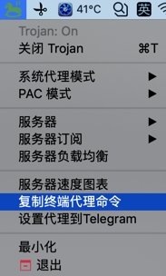
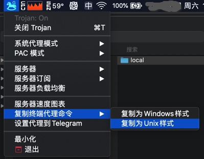

# 从客户端获取代理配置

此处介绍，从科学上网类的客户端，获取当前代理配置信息。

* 科学上网工具的代理信息
  * Shadowsocks类
    * http
      * http://127.0.0.1:1086
    * https
      * https://127.0.0.1:1086
    * socks5
      * socks5://127.0.0.1:1086
    * PAC自动代理
      * http://127.0.0.1:8070/proxy.pac
  * Trojan类
    * `Trojan-QT5`:`Mac`的`Trojan-QT5`、`Windows`的`trojan-qt5.exe`
      * 得到代理配置的方式
        * 从窗口底部看到
          * 步骤
            * 打开窗口
              * 
            * 窗口底部有显示当前代理配置信息
              * 
          * 看到的的结果
            * SOCK5 127.0.0.1:51837
            * HTTP 127.0.0.1:58591
            * PAC 127.0.0.1:8070
          * => 意味着完整代理地址是
            * SOCK5
              * socks5://127.0.0.1:51837
            * HTTP
              * http://127.0.0.1:58591
              * https://127.0.0.1:58591
            * PAC = 自动模式 = 自动代理
              * http://127.0.0.1:8070/proxy.pac
        * 从菜单中拷贝得到
          * 步骤
            * 托盘图标 ->`复制终端代理命令`
              * Win
                * 
              * Mac
                * 
                  * 新版同时支持`Mac`和`Win`的配置
                    * 
          * 拷贝出的值是
            * `Mac`
                ```bash
                export HTTP_PROXY=http://127.0.0.1:58591; export HTTPS_PROXY=http://127.0.0.1:58591; export ALL_PROXY=socks5://127.0.0.1:51837
                ```
            * `Windows`
                ```bash
                export HTTP_PROXY=http://127.0.0.1:1081; export HTTPS_PROXY=http://127.0.0.1:1081; export ALL_PROXY=socks5://127.0.0.1:1080
                ```
          * 如何用
            * 具体使用方式，详见后续章节：[如何添加代理](http://book.crifan.com/books/web_transfer_proxy_tech/website/add_proxy/)

