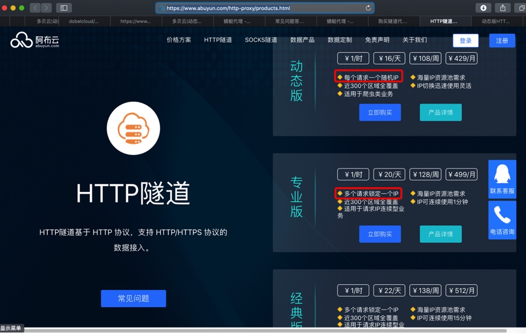

# 多个请求锁定一个IP

[动态版HTTP隧道服务说明 | 阿布云 - 为大数据赋能](https://www.abuyun.com/http-proxy/dyn-intro.html)

> 产品说明
> 
> HTTP隧道 基于 HTTP 协议，支持 HTTP/HTTPS 协议的数据接入
> 
> 平台在云端维护一个全局 IP池 供 HTTP隧道 使用，池中的 IP 会不间断更新，以保证 IP池 中有足够多的 IP 供用户使用。
> 
> 需要注意的是 IP池 中有部分 IP 可能会在当天重复出现多次。
> 
> 动态版 HTTP隧道 会为每个请求从 IP池 中挑选一个随机 IP。

然后再仔细看，才懂：

[HTTP隧道产品 | 阿布云 - 为大数据赋能](https://www.abuyun.com/http-proxy/products.html)

* 每个请求一个随机IP
  * 每次http请求，IP都不同
* 多个请求锁定一个IP
  * 每几次连续的IP池的请求，或者说每一段时间内的请求，IP是一样的
    * 典型的是，对应的是：
      * 比如
        * [专业版HTTP隧道服务说明 | 阿布云 - 为大数据赋能](https://www.abuyun.com/http-proxy/pro-intro.html)
        > 每一个 IP 从隧道切换至该 IP 开始计时，最多只能使用 1 分钟，到期后系统将强制切换到另一个 IP
        * 就是说：每1分钟内的请求，都是同一个IP
          * 更深入的解释相关内容
            > 两次手动切换 IP 的间隔时间不得少于 1 秒
          * 指的是：如果支持手动切换IP（某些套餐才支持，有些不支持）的话，（调用api去）切换IP时，不能太频繁，间隔不能小于1秒
  * 但是对于更多的请求来说，IP是变化的
