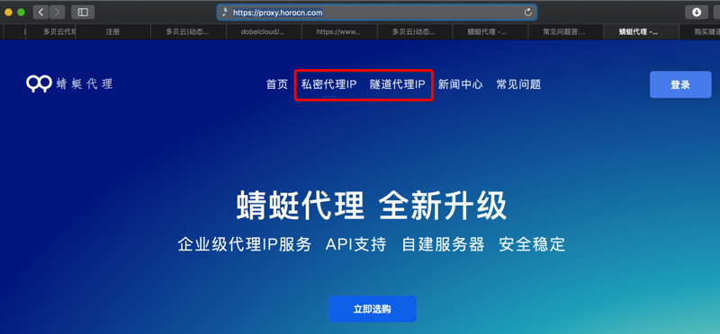
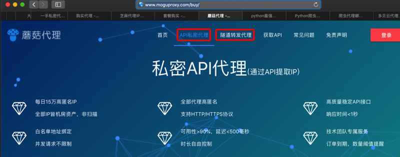
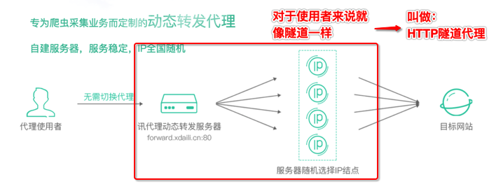

# 私密代理 vs 隧道代理

在一些IP代理池提供商中看到了：

* 私密代理IP
* 隧道代理IP

比如：

* [蜻蜓代理 - 企业级高质量代理ip平台](https://proxy.horocn.com)
  * 
* [蘑菇代理 - 购买API代理](http://www.moguproxy.com/buy/)
  * 
* [动态版HTTP隧道服务说明 | 阿布云 - 为大数据赋能](https://www.abuyun.com/http-proxy/dyn-intro.html)
  * 动态版 HTTP隧道

好像没太明白：

IP代理池，都是动态的IP

但是 私密 vs 隧道 是什么区别？

再自己看解释：看懂了：

* 蜻蜓代理
  * 文档
    * [购买私密代理 - 蜻蜓代理 - 企业级高质量代理ip平台](https://proxy.horocn.com/buy-secret-proxy.html)
    * [购买隧道代理 - 蜻蜓代理 - 企业级高质量代理ip平台](https://proxy.horocn.com/buy-tunnel-proxy.html)
  * 含义
    * 私密代理
      * 通过API提取IP
        * 全部代理高匿名，白名单地址绑定，每天最高40万IP
    * 隧道代理
      * 统一入口，随机动态IP
        * 专为爬虫采集业务而定制
* 蘑菇代理
  * 文档
    * [购买 蘑菇代理 - 购买API代理](http://www.moguproxy.com/buy/)
    * [HTTP 蘑菇代理 - 购买API代理](http://www.moguproxy.com/http)
    * [帮助信息 蘑菇代理 - 购买API代理](http://www.moguproxy.com/help)
  * 含义
    * 私密API代理
      * 通过API提取IP
      * 请求API接口，直接返回IP与端口
    * HTTP隧道代理(动态转发)
      * 统一入口，随机动态出口，每一个请求一个随机IP
      * 接入固定代理服务器，动态转发请求

总结：

* 私密代理=私密API代理=私密代理API
  * 获取动态IP方式：通过API获取代理服务器的信息（IP和端口）
  * 使用方式：你调用api接口获取到IP和端口，自己用IP和端口去代理试用
    * 后来也才看懂
      * [大象代理IP提取-IP地址购买-API-代理服务器提取购买](http://www.daxiangdaili.com)
        * 中的：
          * API返回格式：文本
          * API是否返回地区
          * API是否返回运营商
      * [购买代理 - 快代理](https://www.kuaidaili.com/pricing/#dps)
        * 中的：
          * API最快调用频率 1秒10次
          * API允许调用IP数 2个起
          * API支持返回json, xml
      * [短效优质代理IP- 站大爷](http://ip.zdaye.com/ShortProxy.html)
        * 中的：
          * 每次提取IP数：5个
      * 说的就是：
        * 你自己：去调用api
      * 返回
        * 的内容：IP地址列表
          * 即一次性往往会返回多个IP地址
            * 比如`5`个，`10`个，`100`个等等
        * 格式：`xml`/`json`/`txt`
      * 且你调用API接口的频率也不能太高
        * 比如最多`10次/秒`
* HTTP隧道代理
  * 获取动态IP方式：通过http代理提取
    * 此处的 http代理=HTTP隧道=HTTP隧道代理=服务商提供的一个HTTP代理服务器
      * 可以动态的，根据不同请求，内部使用不同IP
  * 使用方法：配置好HTTP（隧道）代理服务器后，后续请求，先到HTTP代理服务器，内部会自动的使用动态的IP转发请求
    * 适合爬虫采集

## HTTP隧道代理

IP代理 根据协议，分很多种：

* HTTP/HTTPS
* SOCKS
* 等等

其中用HTTP协议的隧道代理，叫`HTTP隧道代理`

比如：

* [HTTP隧道产品 | 阿布云 - 为大数据赋能](https://www.abuyun.com/http-proxy/products.html)
* [讯代理-爬虫代理-HTTP代理-代理服务器](http://www.xdaili.cn/buyproxy)
* [多贝云|动态IP代理拨号代理VPN代理动态HTTP代理](http://dobel.cn/act/https_pro/index.html)

用图解释就更容易懂了：

* 
* 
